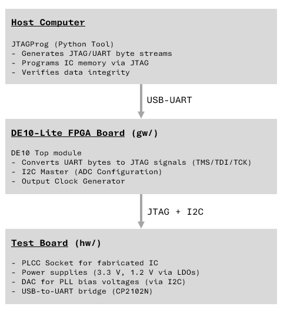

# VLSI Test Platform

A complete hardware and software solution for bringing up and testing the VLSI SoC Project IC. This repository contains the FPGA firmware, Python host tools, and hardware design documentation.

## System Overview

The test platform consists of three integrated components:

<div align="center">
    
</div>

## Directory Structure

```
vlsi_test_platform/
├── gw/                    # FPGA Firmware (DE10-Lite)
│   ├── src/              # SystemVerilog modules
│   │   ├── DE10Top.sv    # Top-level module
│   │   ├── jtag_uart_bridge.sv
│   │   ├── jtag_engine.sv
│   │   ├── adc_commander.sv
│   │   ├── i2c_master.sv
│   │   └── uart_*.sv     # UART controller modules
│   ├── test/             # DUT (Device Under Test) bitstreams
│   └── README.md         # FPGA documentation
│
├── sw/                    # Host-Side Python Tools
│   ├── JTAGProg.py       # JTAG programmer and tester
│   └── README.md         # Python tool documentation
│
├── hw/                    # Test Board PCB Design
│   ├── [Schematic/Layout files]
│   └── README.md         # Hardware documentation
│
└── README.md             # This file
```

## Quick Start

### Prerequisites

1. **Hardware**: DE10-Lite FPGA board and VLSI test board
2. **Software**: Quartus Prime, Python 3.6+, pyserial

### 1. Program the FPGA

1. Load the compiled FPGA design (`.sof` file) onto the DE10-Lite using Quartus Programmer
2. The FPGA automatically configures the test board DAC after reset
3. Verify that the USB-UART bridge is recognized on your host computer

### 2. Program the IC via JTAG

```bash
# Test mode: verify JTAG communication with a known pattern
python JTAGProg.py COM4 --test-mode --word-count 256

# Load mode: program memory from a hex file
python JTAGProg.py COM4 program.hex
```

See [sw/README.md](sw/README.md) for full usage details.

### 3. Verify the Setup

- Check that the test board LEDs indicate correct power and USB connection
- Monitor JTAG read/write throughput in the python interface output
- Inspect the IC power supplies and clock signals with an oscilloscope if needed

## Component Details

### FPGA Firmware (gw/)

The DE10-Lite FPGA implements:
- **UART-to-JTAG Bridge**: Converts serial bytes to JTAG protocol for IC programming
- **I2C Master**: Configures the DAC for PLL bias voltages
- **Clock Generator**: Produces a test clock output

[Read more](gw/README.md)

### Python Host Tool (sw/)

`JTAGProg.py` provides:
- **Test Mode**: Random write/read verification for JTAG communication
- **Load Mode**: Program IC memory from a plain-text hex file
- **Performance Monitoring**: Reports read/write throughput and errors

[Read more](sw/README.md)

### Test Board Hardware (hw/)

The PCB includes:
- PLCC socket for the VLSI IC
- Power management (3.3 V and 1.2 V LDOs)
- DAC for PLL bias voltage tuning
- USB-to-UART bridge (CP2102N)
- FPGA connector for control signals (JTAG, I2C, clock)
- Reset button and DIP switch for PLL frequency selection

[Read more](hw/README.md)


## References

- Altera DE10-Lite Board: [User Manual](https://www.intel.com/content/www/us/en/programmable/documentation/boards/de10_lite_user_manual.pdf)
- CP2102N USB-UART IC: [Datasheet](https://www.silabs.com/documents/public/data-sheets/cp2102n-datasheet.pdf)
- DAC7578 DAC IC: [Datasheet](https://www.ti.com/lit/ds/symlink/dac7578.pdf?ts=1773684272389&ref_url=https%253A%252F%252Fwww.ti.com%252Fproduct%252FDAC7578)
